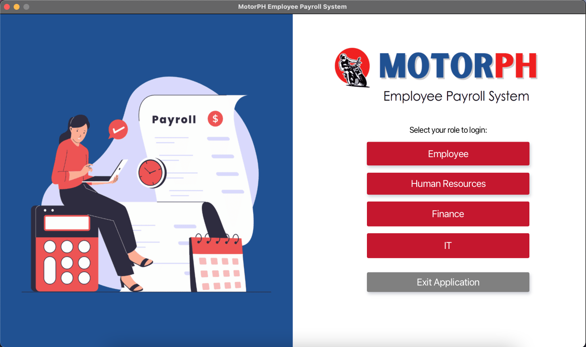
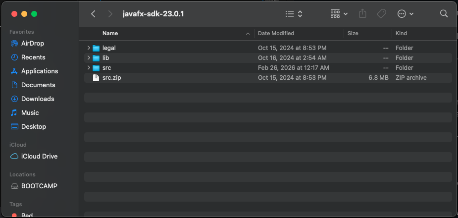
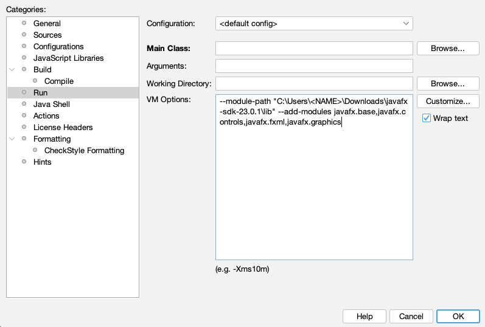
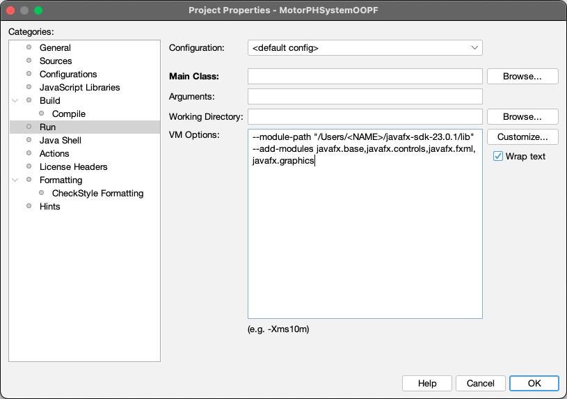
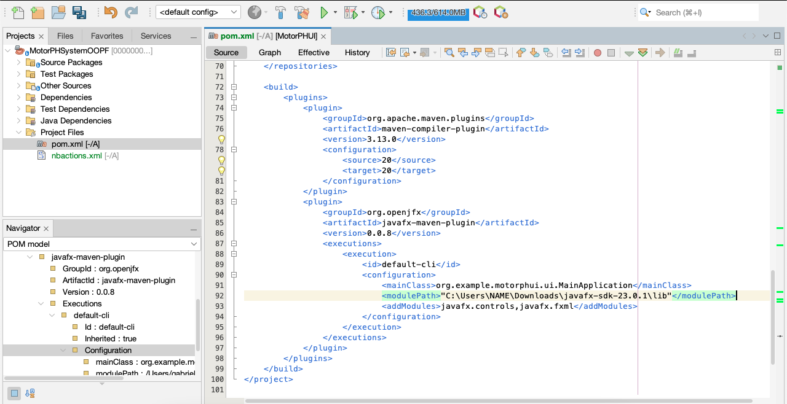
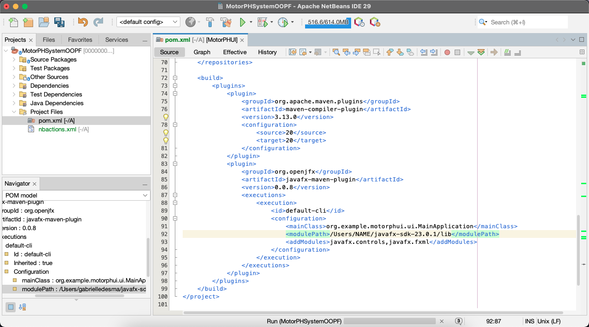

# Object-oriented Programming - MotorPH GUI Payroll System
 
| Subject | Section | Group # |
| :-----: | :-----: | :---: |
| Object-oriented Programming | A2101 | Group 5 |  

| Members: |
| :----: |
| Gabriel Josemaria Ledesma |
| Martin Lanze Catolos |
| Iannah Estrada |
| Nicolo Andrew Sta. Ana |

<br>



<h2>Running the Application</h2>

<h3>Step 1</h3>

This program uses <b>JavaFX 23.0.1</b> components to function. Visit the official website at [GluonHQ](https://gluonhq.com/products/javafx/) then pick & download the appropriate JavaFX 23.0.1 SDK components based on your operating system. Extract the zip file in your Downloads folder. In the extracted folder, make sure to also extract src.zip. 



<h3>Step 2.1</h3>

Download the MotorPH payroll application by downloading the repo as ZIP.

In Netbeans, first open the Payroll program. Then, select the Project, right-click the project and go to Properties. Here, select "Run" found in the Categories list, then paste the following inside VM Options: 

    For Windows:
    --module-path "C:\Users\<NAME>\Downloads\javafx-sdk-23.0.1\lib" --add-modules javafx.base,javafx.controls,javafx.fxml,javafx.graphics

    For macOS:
    --module-path "/Users/<NAME>/Downloads/javafx-sdk-23.0.1/lib" --add-modules javafx.base,javafx.controls,javafx.fxml,javafx.graphics

    Note #1: <NAME> is your computer system's username.
    Note #2: Module path is the file path of JavaFX's libraries.

| OS | Adding Parameters in VM Options  |
| :-----: | :---: |
| In Windows |  |
| In macOS |  |


<h3>Step 2.2</h3>

Additionally, paste just the file location path in the program's pom.xml found in the <i>Project Files</i> folder. More specifically, paste it in line 92 of the xml file where modulePath is located.

| OS | modulePath change in pom.xml  |
| :---: | :---: | 
| In Windows |  |
| In macOS |  |

<h3>Step 3</h3>

After you're done following the instructions above, simply select <b><i>Run Project</i></b> in Netbeans to run the program.

<br>

Note: Do NOT try to run the program by right-clicking ```MainApplication.java``` and then selecting <i>Run File</i> as the program may fail to start.